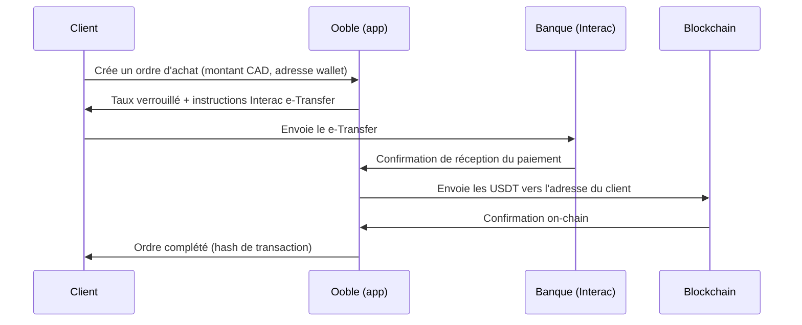
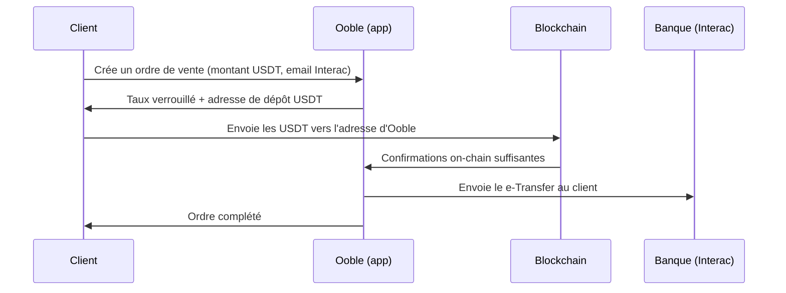

# Architecture — Ooble

Plateforme non-custodiale d'achat et de vente d'USDT en dollars canadiens (CAD), modèle **ordre par ordre** : aucun solde client n'est stocké sur la plateforme.

## 1. Principes

1. **Non-custodial** — Ooble ne détient jamais les fonds des clients. La plateforme détient uniquement sa propre réserve de liquidité USDT et son compte bancaire opérationnel.
2. **Ordre atomique** — chaque transaction est autonome : payée → livrée → clôturée. Pas de wallet client, pas de solde interne.
3. **KYC avant tout** — aucun ordre ne peut être créé tant que l'identité du client n'est pas vérifiée.
4. **Taux verrouillé** — le taux CAD/USDT est figé à la création de l'ordre pour une durée limitée (ex. 15 minutes). Passé ce délai sans paiement, l'ordre expire.

## 2. Flux d'achat (le client achète des USDT)



## 3. Flux de vente (le client vend des USDT)



## 4. Cycle de vie d'un ordre

```
created ──> awaiting_payment ──> payment_received ──> settling ──> completed
   │               │                                      
   └── cancelled   └── expired (délai de verrouillage du taux dépassé)
```

- `created` : ordre créé, taux verrouillé.
- `awaiting_payment` : en attente du CAD (achat) ou des USDT (vente).
- `payment_received` : paiement détecté/confirmé.
- `settling` : Ooble exécute la contrepartie (envoi USDT ou e-Transfer).
- `completed` : contrepartie livrée et confirmée.
- `cancelled` : annulé par le client ou l'admin avant paiement.
- `expired` : aucun paiement reçu dans le délai.

## 5. Modèle de données (PostgreSQL / Supabase)

- **profiles** — profil utilisateur lié à `auth.users` : statut KYC, limites de transaction, coordonnées.
- **kyc_verifications** — suivi des vérifications d'identité (fournisseur tiers, statut, référence externe).
- **orders** — les ordres : sens (achat/vente), montant CAD, montant USDT, taux verrouillé, frais, réseau (TRC20/ERC20), adresse wallet du client ou email Interac, statut, horodatages.
- **order_events** — journal d'audit immuable de chaque changement de statut d'un ordre.
- **payment_confirmations** — confirmations des paiements CAD (référence Interac, montant, horodatage).
- **blockchain_transactions** — transactions on-chain liées aux ordres (hash, réseau, confirmations, montant).
- **exchange_rates** — historique des taux CAD/USDT utilisés (source, taux, horodatage).
- **compliance_flags** — signalements de conformité (transaction > seuil, activité suspecte) pour la revue FINTRAC.

Sécurité : Row Level Security (RLS) activée partout. Un client ne voit que ses propres données ; les opérations d'état (validation de paiement, settlement) passent exclusivement par des Edge Functions avec le rôle service.

## 6. Composants applicatifs

### Frontend (Vite + React + TS + Tailwind/shadcn)
- **Pages publiques** : accueil, taux en direct, FAQ, conditions.
- **Onboarding** : inscription (Supabase Auth), parcours KYC.
- **Achat / Vente** : formulaire d'ordre, verrouillage du taux, instructions de paiement, suivi en temps réel.
- **Historique** : liste des ordres du client avec reçus.
- **Admin** : file de revue KYC, gestion des ordres (confirmation manuelle de paiement au départ), suivi de la liquidité, alertes conformité.

### Backend (Supabase)
- **Auth** : email + mot de passe, 2FA recommandé.
- **Edge Functions** :
  - `create-order` — validation KYC/limites, verrouillage du taux, création de l'ordre.
  - `confirm-payment` — confirmation d'un paiement CAD (manuel au départ, webhook du partenaire de paiement ensuite).
  - `settle-order` — déclenchement de l'envoi USDT ou du e-Transfer sortant.
  - `watch-deposits` — surveillance des dépôts USDT entrants (ordres de vente).
  - `expire-orders` — tâche planifiée : expiration des ordres non payés.
- **Realtime** : mise à jour du statut de l'ordre côté client.

### Intégrations externes
| Rôle | Fournisseur (candidats) | Notes |
| --- | --- | --- |
| KYC | Persona / SumSub / Veriff | Webhook de résultat → met à jour `kyc_verifications` |
| Paiement CAD | Interac e-Transfer (via VoPay ou équivalent) | Réconciliation automatique des paiements entrants/sortants |
| Taux CAD/USDT | Agrégateur (CoinGecko/Kraken) + marge Ooble | Rafraîchi en continu, verrouillé par ordre |
| Blockchain | Nœud/API (Tron pour TRC20, ou ERC20) | Envoi des USDT + surveillance des dépôts |

## 7. Phases de livraison

1. **Phase 1 — MVP opéré manuellement** : ordres en ligne, taux verrouillé, mais confirmation des e-Transfers et envoi des USDT faits manuellement par l'admin depuis le dashboard. C'est le chemin le plus court vers un produit utilisable et ça limite le risque technique.
2. **Phase 2 — Semi-automatisation** : webhooks de paiement (réconciliation Interac automatique), surveillance automatique des dépôts USDT.
3. **Phase 3 — Automatisation complète** : settlement automatique avec limites de sécurité (montant max auto-approuvé, revue manuelle au-delà).

## 8. Conformité (Canada)

Même en non-custodial, l'échange fiat ↔ crypto est une activité d'**entreprise de services monétaires (ESM/MSB)** au sens de la LRPCFAT :

- **Inscription FINTRAC** obligatoire avant d'opérer avec de vrais fonds.
- **Programme de conformité** : agent de conformité désigné, politiques écrites, évaluation des risques, formation.
- **KYC** : vérification d'identité pour tous les clients.
- **Déclarations** : transactions en monnaie virtuelle ≥ 10 000 $ CAD (24 h), déclarations d'opérations douteuses (DOD).
- **Conservation des dossiers** : 5 ans.
- **Règle du voyage (Travel Rule)** : informations sur le donneur d'ordre/bénéficiaire pour les transferts de monnaie virtuelle ≥ 1 000 $ CAD.

Le schéma de données (`order_events`, `compliance_flags`, `kyc_verifications`) est conçu pour produire ces déclarations et cet audit trail.
